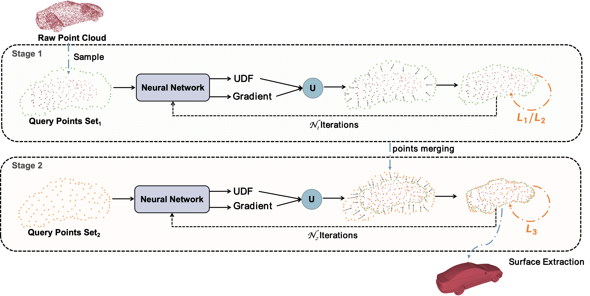
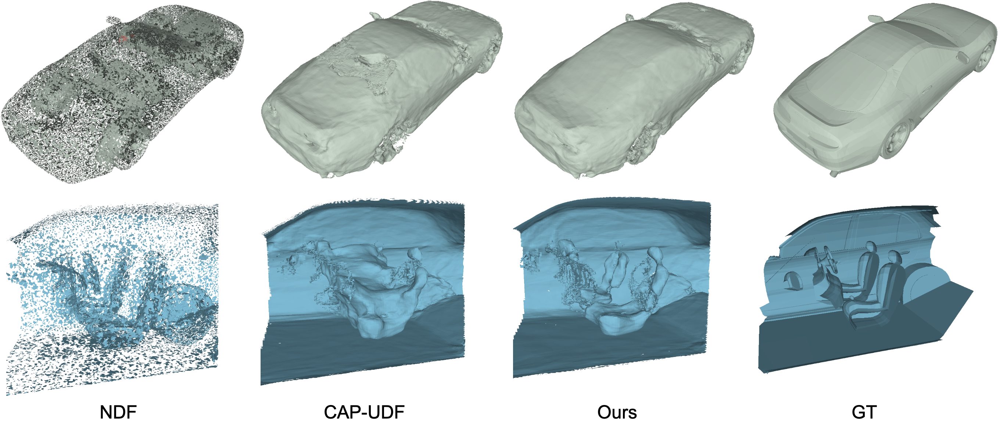
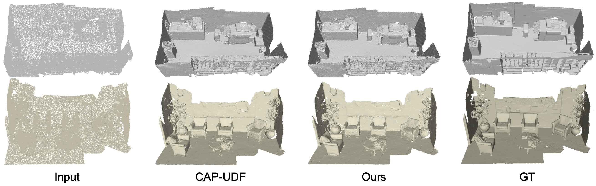
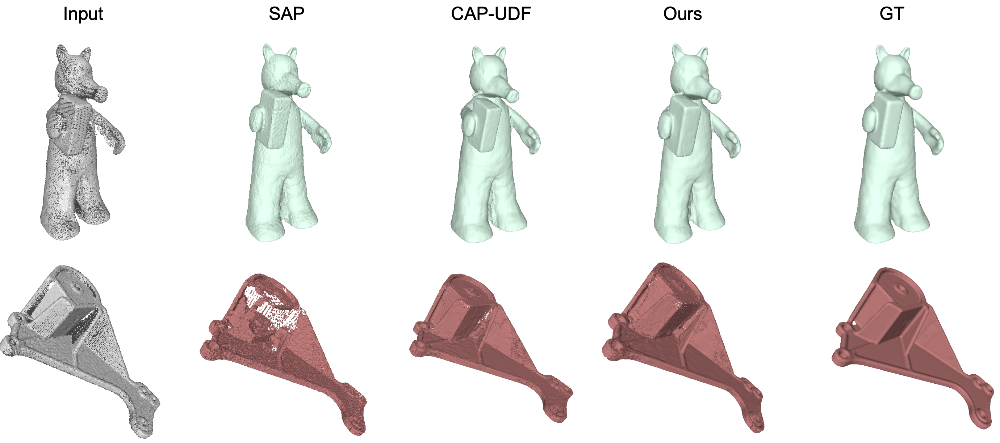

<p align="center">

  <h1 align="center">LEARNING DENSITY REGULATED AND MULTI-VIEW CONSISTENT UNSIGNED
DISTANCE FIELDS</h1>
  <h2 align="center">ICASSP 2024</h2>
  <h3 align="center"><a href="https://ieeexplore.ieee.org/abstract/document/10447163
">Paper</a></h3>
  <div align="center"></div>
</p>

## Overview
<p align="center">
  
</p>

Learning unsigned distance fields (UDF) directly from raw point clouds as the implicit representation for surface reconstruction is a promising learning-based method for reconstructing open surfaces and supervision-free attributes. In most UDF methods, Chamfer Distance (CD), the commonly
used metric in 3D domains is reckoned as the preferable loss function for training neural networks that predict UDFs. However, CD intrinsically suffers from deficiencies like the insensitivity to point density distribution and the inclination to be diverged by outliers, which may severely hamper the
reconstruction performance. In this regard, we propose DM-UDF, a method that learns density-regulated and multi-view consistent UDFs by revising CD loss with the dynamic three-phase loss function. Specifically, we adopt a carefully designed CD derivative called Density-aware Chamfer Distance
(DCD) for detecting different density distributions to alleviate the distribution imbalance problem in the reconstructed surfaces. Further, to generate surfaces with fine-grained local details, a differentiable rendering view loss is also introduced into the hybrid design of our loss function, measuring the
fidelity of projected images under different camera poses to maintain multi-view consistency. We conducted surface reconstruction tasks on both synthetic and real scan datasets and experimental results show that DM-UDF achieves state-of-the-art performance.

## Demo Results
### ShapeNetCars
<p align="center">
  
</p>

### 3DScenes
<p align="center">
  
</p>

### SRB
<p align="center">
  
</p>

## Related works
Please also check out the following works that inspire us a lot:
* [Junsheng Zhou et al. - CAP-UDF: Learning Unsigned Distance Functions Progressively from Raw Point Clouds with Consistency-Aware Field Optimization
 (TPAMI2024/NeurIPS2022)] (https://github.com/junshengzhou/CAP-UDF)

* [Baorui Ma et al. - Neural-Pull: Learning Signed Distance Functions from Point Clouds by Learning to Pull Space onto Surfaces (ICML2021)](https://github.com/mabaorui/NeuralPull-Pytorch)
* [Baorui Ma et al. - Surface Reconstruction from Point Clouds by Learning Predictive Context Priors (CVPR2022)](https://mabaorui.github.io/PredictableContextPrior_page/)
* [Baorui Ma et al. - Reconstructing Surfaces for Sparse Point Clouds with On-Surface Priors (CVPR2022)](https://mabaorui.github.io/-OnSurfacePrior_project_page/)

## Installation
Our code is implemented in Python 3.8, PyTorch 1.11.0 and CUDA 11.3.
- Install python Dependencies
```bash
conda create -n capudf python=3.8
conda activate capudf
conda install pytorch torchvision torchaudio cudatoolkit=11.3 -c pytorch
pip install tqdm pyhocon==0.3.57 trimesh PyMCubes scipy point_cloud_utils
```
- Compile C++ extensions
```
cd extensions/chamfer_dist
python setup.py install
```

## Dataset
We provide the processed data for ShapeNetCars, 3DScenes and SRB dataset [here](https://drive.google.com/file/d/1BNzmd_OX0s4lxta3FFeRWRYwfGQOALS_/view?usp=sharing). Unzip it to the `./data` folder. The datasets is organised as follows:
```
│data/
├──shapenetCars/
│  ├── input
│  ├── ground_truth
│  ├── query_data
├──3dscene/
│  ├── input
│  ├── ground_truth
│  ├── query_data
├──srb/
│  ├── input
│  ├── ground_truth
│  ├── query_data
```
We provide all data of the 3DScenes and SRB dataset, and two demos of the ShapeNetCars. The full set data of ShapeNetCars will be uploaded soon.

## Train
You can train our DM-UDF to reconstruct surfaces from a single point cloud as:

- ShapeNetCars
```
python run.py --gpu 0 --conf confs/shapenetCars.conf --dataname 3e5e4ff60c151baee9d84a67fdc5736 --dir 3e5e4ff60c151baee9d84a67fdc5736
```

- 3DScene
```
python run.py --gpu 0 --conf confs/3dscene.conf --dataname lounge_1000 --dir lounge_1000
```

- SRB
```
python run.py --gpu 0 --conf confs/srb.conf --dataname gargoyle --dir gargoyle
```

You can find the generated mesh and the log in `./outs`.

## Test
You can evaluate the reconstructed meshes and dense point clouds as follows:

- ShapeNetCars
```
python evaluation/shapenetCars/eval_mesh.py --conf confs/shapenetCars.conf --dataname 3e5e4ff60c151baee9d84a67fdc5736 --dir 3e5e4ff60c151baee9d84a67fdc5736
```

- 3DScene
```
python evaluation/3dscene/eval_mesh.py --conf confs/3dscene.conf --dataname lounge_1000 --dir lounge_1000
```

- SRB
```
python evaluation/srb/eval_mesh.py --conf confs/srb.conf --dataname gargoyle --dir gargoyle
```

For evaluating the generated dense point clouds, you can run the `eval_pc.py` of each dataset instead of `eval_mesh.py`. 

## Use Your Own Data
We also provide the instructions for training your own data in the following.

### Data
First, you should put your own data to the `./data/owndata/input` folder. The datasets is organised as follows:
```
│data/
├──shapenetCars/
│  ├── input
│      ├── (dataname).ply/xyz/npy
```
We support the point cloud data format of `.ply`, `.xyz` and `.npy`

### Run
To train your own data, simply run:
```
python run.py --gpu 0 --conf confs/base.conf --dataname (dataname) --dir (dataname)
```

## Acknowledgement
Our code is based on the [CAP-UDF](https://github.com/junshengzhou/CAP-UDF).We thank the authors for their contributions.

## Citation
If you find our code or paper useful, please consider citing

    @inproceedings{zhang2024learning,
  title={Learning Density Regulated and Multi-View Consistent Unsigned Distance Fields},
  author={Zhang, Rui and Xu, Jingyi and Yang, Weidong and Ma, Lipeng and Chen, Menglong and Fei, Ben},
  booktitle={ICASSP 2024-2024 IEEE International Conference on Acoustics, Speech and Signal Processing (ICASSP)},
  pages={8366--8370},
  year={2024},
  organization={IEEE}}

